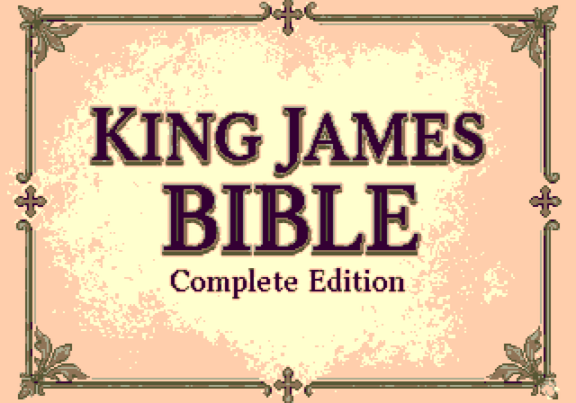
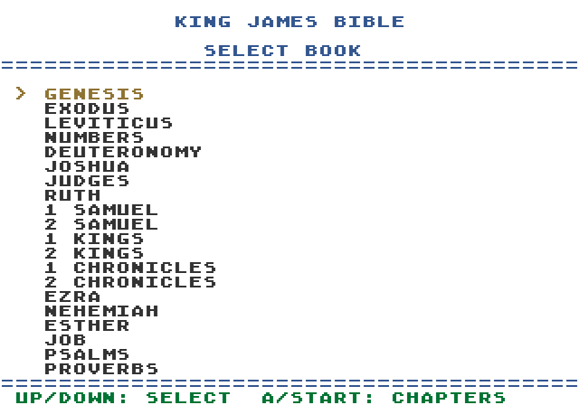
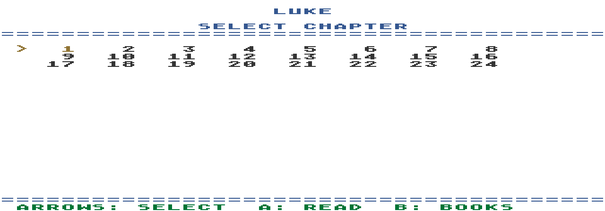
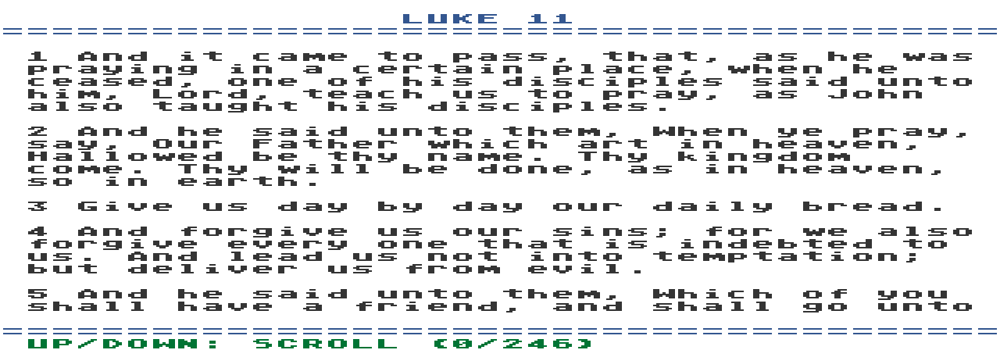

# Mega Drive Bible (SGDK)

A Sega Mega Drive / Genesis homebrew project that lets you browse and read Bible books and chapters directly on the console.

## Features

- Book selection screen with scrolling list
- Chapter selection grid
- In-game reading mode with wrapped text and vertical scrolling
- Splash screen and custom UI palette

## Screenshots

|  |  |
|---|---|
|  |  |
|  |  |

## Requirements

- [SGDK](https://github.com/Stephane-D/SGDK) installed locally
- Mega Drive toolchain available under `$HOME/SGDK`

## Build

```bash
make
```

This generates `bible.bin` (ROM image) from the project sources.

## Controls

- `UP/DOWN`: Select book
- `A` or `START`: Open chapters / confirm
- `B`: Back
- `C`: Return to books (from reading mode)

## Project Structure

- `main.c`: UI, navigation and rendering logic
- `bible_data.c` / `bible_data.h`: Bible data tables
- `res/`: Visual assets and SGDK resource definitions
- `tools/`: Helper scripts/tools used during content prep

## License

No license file is currently included.
